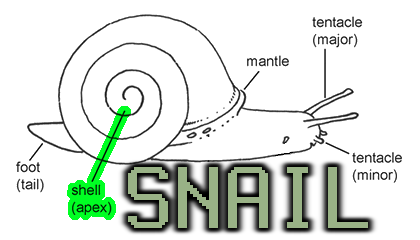

# [SnailJS](//github.com/snailjs/).[Apex-Connect](//github.com/snailjs/apex-connect/) [](https://travis-ci.org/snailjs/apex-connect)


##SnailJS Apex Authentication Library

### Simple Example Using Express.io

```js
var ApexConnect = require("apex-connect")
  , email = "user1@domain.org"
  , password = "password"
  , express = require("express.io")
  , app = express().http().io()

//do initial connect during startup
app.apex = new ApexConnect("http://my-apex-server","mysecret")
app.apex.connect(function(err,auth_token){
  if(err) console.log("Failed to connect to Apex: " + err)
  //do something with auth_token
  //say the connection failure is critical then listen here
  //app.listen()
})

//setup authorize as a route
app.post("/login",function(req,res){
  var data = {
    collection: "staff",
    id: req.body.email,
    password: req.body.password
  }
  app.apex.authorize(data,function(err,inst){
    if(err) res.send("Failed to login")
    else {
      //save user instance to session
      req.session.apex = inst
      //notify success
      res.send("Successfully logged in here is your token: " + inst.token)
  })
})

//setup creation as a route
app.post("/staff/create",function(req,res){
  var data = {
    email: req.body.email,
    password: req.body.password,
    name: {
      first: req.body.name.first,
      last: req.body.name.last
    }
  }
  req.session.apex.call("/staff/create",data,function(err,res){
    if(err) res.send("Failed to create staff member")
    else res.send("Success! Staff member created")
  })
})

//say getting started is more important than server now and simply log errors
app.listen()
```

### API Reference

#### Authentication

##### Constructor

```js
var myapex = new Connect("http://server","mysecret")
```

Constructs the initial instance and stores the secret and server hostname. No connection
is made at this time.

##### Connect

```js
Connect.connect(secret)
```

Issues a connect authorization call the apex server using the secret.

Upon success the server will return a session token to be used by the server to make requests.

##### Authorize

```js
var data = {collection: "staff", id: "email@email.org", password: "pass"}
Connect.authorize(data,function(err,inst){})
```

Issues an authorization request. Upon success of login success it returns an instance that will
use the session token for all further requests.

**Note** the session token should be used on all subsequent requests.

##### Call

```js
apex.call("/my/uri",{blah: "mydata"},function(err,res){})
```

Issues an arbitrary call the Apex server. This is the main method for making data requests.